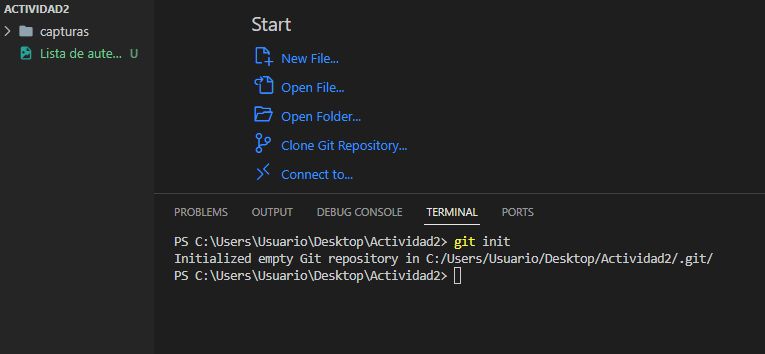
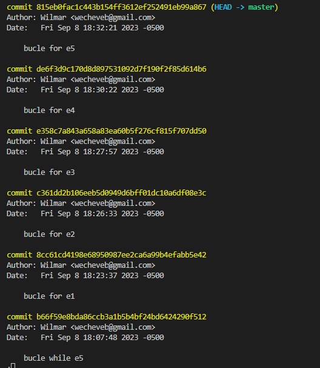
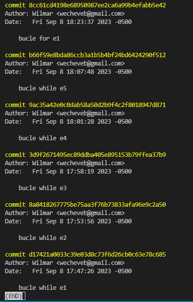

<!-- No borrar o modificar -->
[Inicio](./index.md)

## Sesión 2

# Ejercicios de Estructuras de Control Iterativas

## Ejercicios con bucle while:

1. **Encontrar el número mayor y el menor:**
   - Archivo: [ejercicio1.py](ejercicio1.py)
   - Descripción: Solicita al usuario una lista de números y encuentra el número mayor y el menor.
   ### Solución
   

2. **Suma de números pares:**
   - Archivo: [ejercicio2.py](ejercicio2.py)
   - Descripción: Solicita al usuario un número e imprime la suma de los números pares entre 1 y ese número.
   ### Solución
   

3. **Contar vocales:**
   - Archivo: [ejercicio3.py](ejercicio3.py)
   - Descripción: Solicita al usuario una cadena e imprime cuántas vocales contiene.
   ### Solución
   

4. **Tabla de potencias:**
   - Archivo: [ejercicio4.py](ejercicio4.py)
   - Descripción: Solicita al usuario un número y muestra su tabla de potencias desde 1 hasta 10.
   ### Solución
   

5. **Media aritmética:**
   - Archivo: [ejercicio5.py](ejercicio5.py)
   - Descripción: Solicita al usuario una lista de números y calcula la media aritmética.
   ### Solución
   

## Ejercicios con bucle for:

6. **Suma de elementos de una lista:**
   - Archivo: [ejercicio6.py](ejercicio6.py)
   - Descripción: Solicita al usuario una lista de números y calcula la suma de sus elementos.
   ### Solución
   

7. **Contar números pares en una lista:**
   - Archivo: [ejercicio7.py](ejercicio7.py)
   - Descripción: Solicita al usuario una lista de números e imprime cuántos de ellos son pares.
   ### Solución
   

8. **Tabla de multiplicar:**
   - Archivo: [ejercicio8.py](ejercicio8.py)
   - Descripción: Solicita al usuario un número y muestra su tabla de multiplicar usando `range()`.
   ### Solución
   

9. **Números pares desde 2 hasta un número dado:**
   - Archivo: [ejercicio9.py](ejercicio9.py)
   - Descripción: Solicita al usuario un número e imprime los números pares desde 2 hasta ese número.
   ### Solución
   

10. **Secuencia de números pares:**
    - Archivo: [ejercicio10.py](ejercicio10.py)
    - Descripción: Solicita al usuario un número y muestra la secuencia de números pares desde 2 hasta ese número.
    ### Solución
   

## Capturas de pantalla del repositorio local

### Comando git init

### Comando git add

### Comando para evidenciar los commit

